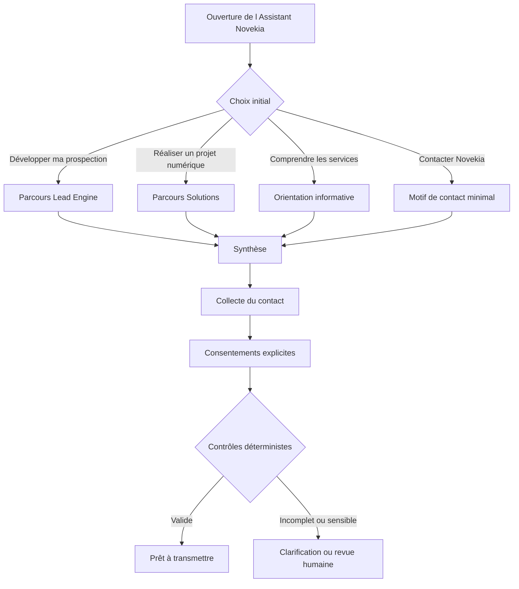
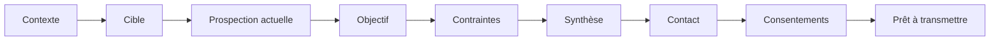
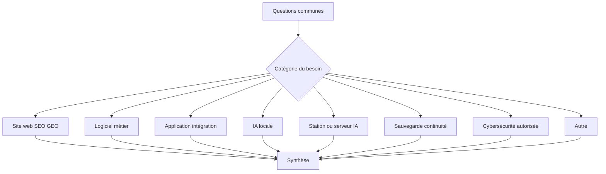
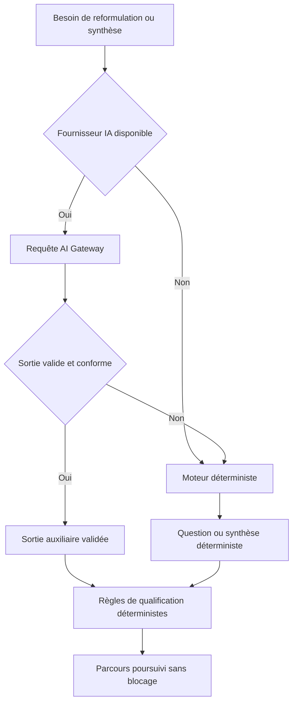

# Contrat fonctionnel — Assistant Novekia V1

Version du schéma : `1.0.0`
Statut : socle contractuel, sans interface ni intégration réseau

## 1. Objectif du concierge

L’**Assistant Novekia** est un assistant numérique déclaré comme automatisé. Il aide un visiteur à :

- comprendre les deux pôles Novekia ;
- sélectionner le parcours le plus pertinent ;
- préciser son contexte, son objectif et ses contraintes ;
- obtenir une synthèse explicable ;
- identifier les informations encore manquantes ;
- préparer un passage vers un échange humain.

Le système doit rester entièrement fonctionnel sans modèle d’intelligence artificielle. La qualification, l’ordre des questions, les validations, le consentement et la décision de préparer une transmission reposent sur des règles déterministes.

Phrase d’ouverture de référence :

> « Parlons de votre objectif. En quelques questions, je peux vous orienter vers le pôle Novekia le plus pertinent et préparer un premier cadrage. »

## 2. Périmètre V1

Ce chantier définit uniquement :

- le modèle sérialisable d’une session ;
- le contrat déclaratif d’une question et d’une étape système ;
- les parcours Lead Engine Studio, Novekia Solutions, information et contact direct ;
- les règles déterministes de complétude et de qualification ;
- le contrat abstrait d’une future AI Gateway ;
- les événements analytics non sensibles ;
- les fonctions pures de validation des réponses et des graphes de parcours ;
- le contrat de synthèse, de contact et de consentement.

## 3. Hors périmètre

Sont explicitement exclus :

- toute interface React, fenêtre de chat, avatar, animation ou bouton flottant ;
- tout endpoint API ou appel réseau ;
- toute intégration Mistral, LM Studio, OVH, Resend ou base de données ;
- tout stockage local, cookie ou mécanisme de session navigateur ;
- toute campagne commerciale automatique ;
- toute modification du site visible, des mentions légales ou de la politique de confidentialité ;
- toute décision commerciale, contractuelle ou juridique automatisée.

## 4. Positionnement de l’Assistant Novekia

Le nom affichable est **Assistant Novekia**. Il doit toujours être présenté comme un assistant numérique Novekia et ne doit jamais laisser croire qu’une personne humaine répond en direct.

L’assistant peut expliquer, orienter, reformuler, structurer et préparer une synthèse. Il ne peut pas :

- inventer un prix, une disponibilité ou un service ;
- promettre un volume de prospects ou garantir des rendez-vous ;
- garantir un classement SEO ou une citation par un moteur génératif ;
- confirmer la faisabilité d’un projet sans validation humaine ;
- présenter une donnée publique comme certaine sans preuve ;
- accepter un projet ou prendre une décision contractuelle au nom de Novekia.

## 5. Parcours visiteurs

Les quatre choix initiaux sont stables :

1. **Développer ma prospection** → `lead_engine`
2. **Réaliser un projet numérique** → `solutions`
3. **Comprendre les services Novekia** → `information`
4. **Contacter directement Novekia** → `direct_contact`

Le choix `unknown` reste disponible dans l’état de session tant qu’aucune orientation n’a été effectuée.

## 6. Arbre Lead Engine Studio

Le parcours `lead_engine` couvre cinq sections.

### A. Contexte

- `lead.company_name`
- `lead.company_website` — facultatif
- `lead.sector`
- `lead.offer`
- `lead.respondent_role` — facultatif

### B. Cible

- `lead.target_customer`
- `lead.target_company_profile`
- `lead.target_geography`
- `lead.target_roles`

### C. Prospection actuelle

- `lead.current_prospecting`
- `lead.sales_team`
- `lead.crm_tools` — facultatif
- `lead.current_volume` — facultatif

### D. Objectif

- `lead.main_objective`
- `lead.monthly_objective` — objectif indicatif, jamais une promesse
- `lead.main_difficulty`
- `lead.timeframe`

### E. Contraintes

- `lead.regulatory_constraints` — facultatif, déclenche une revue si renseigné
- `lead.refused_channels`
- `lead.human_review_points` — facultatif
- `lead.indicative_budget` — facultatif, uniquement en fin de cadrage

L’absence de budget ou de site internet ne disqualifie pas une demande.

## 7. Arbre Novekia Solutions

Le parcours `solutions` commence par un tronc commun :

- `solutions.company_name`
- `solutions.company_website` — facultatif
- `solutions.sector`
- `solutions.need_category`
- `solutions.project_description`
- `solutions.current_state`
- `solutions.expected_users`
- `solutions.timeframe`
- `solutions.budget_range` — facultatif
- `solutions.constraints` — facultatif
- `solutions.data_sensitivity`
- `solutions.human_review_need` — facultatif

La catégorie sélectionnée ouvre une branche spécialisée :

| Catégorie | Préfixe stable | Informations spécialisées |
|---|---|---|
| Site web, SEO et GEO | `solutions.website_seo_geo.*` | création/refonte, objectifs, site actuel, fonctionnalités, marchés, contenus, SEO, GEO |
| Logiciel métier | `solutions.business_software.*` | processus, utilisateurs, règles, outils, intégrations, migration, droits, criticité |
| Application et intégration | `solutions.web_app_integration.*` | systèmes, tâches, déclencheurs, volumes, API, résultat, tolérance aux erreurs |
| IA locale | `solutions.local_ai.*` | cas d’usage, données, confidentialité, modèles, utilisateurs, latence, environnement, hors ligne |
| Infrastructure IA | `solutions.ai_infrastructure.*` | modèles, simultanéité, taille, charge, disponibilité, énergie/bruit, local, budget |
| Sauvegarde et continuité | `solutions.backup_continuity.*` | données, volumétrie, équipements, fréquence, hors site, chiffrement, restauration, criticité |
| Cybersécurité autorisée | `solutions.cybersecurity_authorized_audit.*` | cible, autorisation, liste blanche, objectif, sensibilité, test, type d’audit |
| Autre | `solutions.other.*` | description et orientation humaine |

### Garde-fous cybersécurité

La branche cybersécurité sert exclusivement à une qualification initiale. Elle ne réalise aucune action active.

- une autorisation écrite est obligatoire avant tout audit actif ;
- la maîtrise juridique de la cible doit être prouvée ;
- le périmètre doit être défini en liste blanche ;
- aucun test hors périmètre n’est autorisé ;
- aucune certification ni absence de vulnérabilité n’est promise ;
- une autorisation absente ou incertaine bloque la préparation à l’action et impose une revue humaine.

## 8. Contact et consentement

La collecte de contact ne devient accessible qu’après `summary.review`.

Champs de contact :

- `contact.full_name` — requis ;
- `contact.company` — requis ;
- `contact.role` — facultatif ;
- `contact.email` — requis ;
- `contact.phone` — facultatif ;
- `contact.preferred_contact` — facultatif.

Deux consentements distincts et non précochés sont requis :

1. `consent.contact`
   - « J’accepte que Novekia utilise les informations fournies afin de me recontacter au sujet de ma demande. »
2. `consent.privacy`
   - « Je reconnais avoir pris connaissance de la politique de confidentialité de Novekia. »

Chaque preuve de consentement contient :

- `consentGranted` ;
- `consentTextVersion` ;
- `consentedAt` au format ISO ou `null` ;
- `privacyPolicyVersion`.

La session ne peut atteindre `ready_to_submit` que lorsque les deux consentements sont explicitement accordés et datés.

## 9. Modèle d’état

`ConciergeSession` est sérialisable en JSON et contient :

- identité et version : `sessionId`, `schemaVersion` ;
- état : `status`, `activePath`, `currentStepId` ;
- dates ISO : `startedAt`, `updatedAt`, `completedAt` ;
- origine : `sourcePage`, `referrer`, `attribution` ;
- données déclarées : `answers` ;
- contrôles : `missingRequiredFields`, `completionScore` ;
- résultat : `qualificationResult`, `summary` ;
- contact et consentements : `contact`, `consent` ;
- sécurité : `humanReviewRequired`, `errors`.

Statuts autorisés :

`idle`, `started`, `choosing_path`, `qualifying`, `reviewing_summary`, `collecting_contact`, `awaiting_consent`, `ready_to_submit`, `submitted`, `abandoned`, `error`.

## 10. Qualification déterministe

La complétude et la qualification sont deux notions distinctes.

### Complétude

`calculateCompletenessScore` mesure de 0 à 100 la quantité de réponses disponibles sur les questions visibles. Une question requise pèse deux fois une question facultative. Ce score ne représente ni la valeur financière du prospect ni une probabilité de vente.

### Qualification

`qualifyConciergeSession` produit :

- `path` ;
- `completenessScore` ;
- `qualificationLevel` : `insufficient`, `exploratory`, `relevant`, `strong` ;
- `readiness` : `not_ready`, `needs_clarification`, `ready_for_human_review`, `ready_for_contact` ;
- `positiveSignals` ;
- `missingInformation` ;
- `risks` ;
- `recommendedNextAction` ;
- `humanReviewRequired` ;
- `reasons`.

Principes :

- le budget et le site internet ne sont jamais des critères éliminatoires ;
- une demande vague reste en clarification ;
- un score élevé ne garantit aucune vente ;
- une demande dangereuse, illégale ou non autorisée impose une revue humaine ;
- une demande de pentest sans autorisation écrite vérifiable reste `not_ready` ;
- le score n’est pas destiné à être affiché au visiteur dans la V1 ;
- chaque classement produit des raisons explicables.

## 11. Rôle limité de l’intelligence artificielle

Les tâches futures autorisées sont :

- `classify_intent` ;
- `extract_structured_answer` ;
- `rewrite_question` ;
- `summarize_qualification` ;
- `detect_missing_information` ;
- `prepare_human_handoff`.

Le contrat `ConciergeAIRequest` précise notamment la tâche, les identifiants, la locale, l’entrée, le schéma attendu, le contexte, les limites de sortie et de temps, la présence de données personnelles et l’autorisation de fallback.

Le contrat `ConciergeAIResponse` expose le fournisseur, le modèle, la sortie brute et structurée, la confiance, les avertissements, la latence, les compteurs de jetons, le fallback et l’erreur éventuelle.

Les fournisseurs prévus sont : `deterministic`, `mistral`, `lm_studio`, `ovh_endpoint`, `ovh_private`, `unavailable`.

Le modèle :

- ne choisit jamais un consentement ;
- n’accepte jamais seul un lead ;
- ne remplace jamais les règles système ;
- ne reçoit aucune clé depuis les contrats partagés ;
- produit des sorties structurées qui doivent être validées.

## 12. Fallback sans IA

Une panne, un délai dépassé ou une sortie invalide déclenche toujours le fallback. Le parcours, le consentement et la qualification restent utilisables sans IA.

## 13. Transmission future à Novekia

Ce chantier ne transmet aucune donnée. Le futur mécanisme ne pourra préparer une transmission que si :

- le parcours possède une synthèse ;
- les champs requis visibles sont valides ;
- les coordonnées requises sont présentes ;
- les deux consentements sont accordés et datés ;
- aucun risque bloquant n’est actif ;
- les points de revue humaine sont explicitement signalés.

La transmission future devra reprendre la provenance des informations et ne pas transformer une déduction en déclaration du visiteur.

## 14. Événements analytics

Événements contractuels :

- `concierge_impression`
- `concierge_opened`
- `concierge_started`
- `concierge_path_selected`
- `concierge_step_viewed`
- `concierge_step_completed`
- `concierge_step_validation_failed`
- `concierge_summary_viewed`
- `concierge_contact_started`
- `concierge_consent_granted`
- `concierge_submission_ready`
- `concierge_submitted`
- `concierge_abandoned`
- `concierge_ai_requested`
- `concierge_ai_fallback`
- `concierge_error`
- `concierge_human_handoff`

Chaque événement contient uniquement : `eventName`, un identifiant de session pseudonyme, `path`, `stepId`, `sourcePage`, `timestamp` et des métadonnées non sensibles.

Sont interdits dans les analytics : texte libre complet, nom, e-mail, téléphone, données personnelles brutes, secrets, clés ou informations confidentielles.

## 15. Données personnelles

Les questions indiquent explicitement `sensitiveData`. Lorsqu’une donnée sensible est requise, `sensitiveDataJustification` doit expliquer sa nécessité ; le validateur de contrat refuse une exigence sensible non justifiée.

Les réponses libres doivent être considérées comme susceptibles de contenir des données personnelles ou confidentielles. Elles ne doivent jamais être recopiées dans les événements analytics.

La synthèse distingue la provenance de chaque champ :

- `declared` : déclaré directement par le visiteur ;
- `inferred` : déduit et accompagné de `confidence`, `rationale` et `requiresHumanReview` ;
- `system_generated` : produit par une règle déterministe.

## 16. Risques et garde-fous

| Risque | Garde-fou |
|---|---|
| Assistant pris pour un humain | Nom et positionnement explicites d’assistant numérique |
| Prix ou promesse inventée | Aucune donnée tarifaire calculée, aucune garantie autorisée |
| Qualification dépendante d’un LLM | Fonctions pures et règles déterministes |
| Consentement déduit | Valeurs booléennes explicites et horodatées |
| Contact demandé trop tôt | Étape `summary.review` obligatoire avant `contact.*` |
| Audit cyber non autorisé | Autorisation écrite, liste blanche et revue humaine bloquante |
| Sortie IA invalide | Validation structurée et fallback déterministe |
| Fuite via analytics | Contrat de métadonnées limité et liste de champs interdits |
| Boucle ou étape orpheline | Validation statique du graphe et des références |
| Donnée sensible inutilement requise | Justification obligatoire contrôlée statiquement |

## 17. Critères d’acceptation

Le socle est acceptable si :

- les parcours Lead Engine et Solutions sont intégralement représentés ;
- les quatre choix initiaux existent ;
- les identifiants sont stables et uniques ;
- chaque `nextStep` cible une étape existante ;
- chaque parcours atteint `submission.ready` ;
- aucune boucle n’est détectée ;
- la synthèse précède le contact ;
- le contact précède les consentements ;
- la transmission reste impossible sans consentements requis ;
- la qualification fonctionne sans IA ;
- le contrat AI Gateway ne dépend d’aucun fournisseur particulier ;
- aucune dépendance, interface, route API ou intégration réseau n’est ajoutée ;
- TypeScript strict, lint et build de production réussissent.

Les fonctions `validateConciergeDefinition` et `assertConciergeDefinitionIsValid` couvrent les invariants structurels. `validateAnswer`, `shouldDisplayQuestion`, `getNextStepId` et `getMissingRequiredFields` couvrent l’exécution déterministe minimale.

## 18. Questions restant à arbitrer

1. Quelle version textuelle initiale utiliser pour `consentTextVersion` et `privacyPolicyVersion` lors du futur chantier d’interface ?
2. Faut-il rendre `contact.company` facultatif pour les visiteurs indépendants ou conserver un parcours strictement B2B ?
3. Quels délais et plages d’enveloppe afficheront les futures interfaces sans suggérer un tarif officiel ?
4. Quel mécanisme de pseudonymisation de `sessionId` sera retenu pour les analytics ?
5. Quelle durée de conservation appliquer aux sessions abandonnées et aux demandes transmises ?
6. Quelle liste de domaines de messagerie grand public déclenchera seulement un avertissement « e-mail professionnel préféré » ?
7. Quelles catégories de besoins doivent imposer une revue humaine systématique au-delà de la cybersécurité et des données sensibles ?
8. Quel format de handoff sera retenu au prochain chantier : e-mail, CRM, ticket ou combinaison ?
9. Quel fournisseur sera prioritaire derrière l’AI Gateway, sans modifier le fallback déterministe ?
10. Quels tests unitaires seront ajoutés lorsque le dépôt disposera d’un framework de tests approuvé ?
